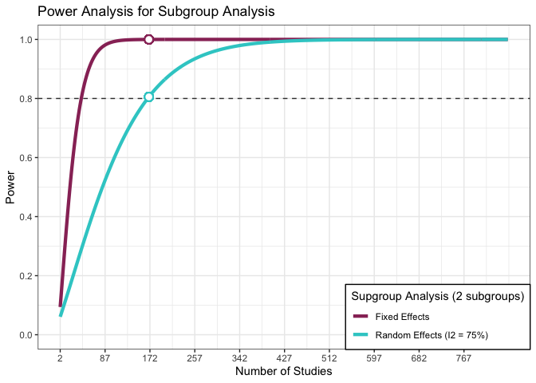
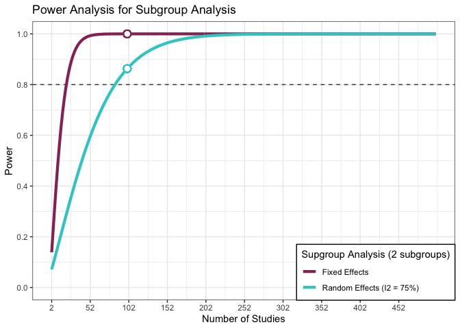

Power calculation
================
Merlin
3/13/2021

### Primary outcomes

2.  Meta-analyze the following results for phase 3 trials, stratified by
    those supported by stringently matched positive phase 2 evidence
    vs. those trials that are not supported by stringently matched
    positive phase 2 on the following outcomes from the phase 3 trials:

<!-- -->

1.  HR of PFS;  
2.  RR of G3/G4 trSAEs.

### Secondary outcomes

3.  RR of G5 trSAEs;
4.  HR of OS;
5.  proportion of phase 3 trials positive on primary endpoint;
6.  proportion of phase 3 trials terminated for safety and/or futility

##### Assumptions

-   Expected number of studies in meta-analysis: “includable” studies
    *k*=150-170

    -   Given the screening effort from the pilot study, we estimate
        feasibility to extract data from a random sample of all
        registered phase 3 studies in the range of 150-170.

-   Expected Degree of heterogeneity (i.e., large *I*2=0.75)

    -   We expect a [“substantial”
        heterogeneity](https://training.cochrane.org/handbook/archive/v6/chapter-10)
        among studies because the review question is very broad (!), so
        that we will need a large number of studies to detect an
        important effect size.

-   Number of subgroups to be compared:

    -   We compare two conditions (phase 3 preceded by stringently
        matched positive phase 2 studies vs. phase 3 studies not
        preceded by the latter)

-   Expected sample size per group:

    -   We expect a typical sample size of phase 3 trials of *N*=300,
        which is conservatively small given the results of a brief
        scoping of clinicaltrials.gov, which yields an average total
        N=396 (SD=318, min.=4, max.=1447). Similarly, the [Djulbegovic
        et
        al (2008)](https://jamanetwork.com/journals/jamainternalmedicine/fullarticle/414102)
        summarized phase 3 trials between 1955 to 2006 with an overall
        mean sample size of 347.

-   Expected effect size:

    -   We express the expected effect size in terms of the
        [standardized mean difference (SMD) aka Cohen’s
        d](https://training.cochrane.org/handbook/archive/v6/chapter-15)
        interpreted as 0.2 representing a small effect, 0.5 a moderate
        effect and 0.8 a large effect (Cohen 1988).
    -   We expect only very small average treatment effects of new
        cancer treatments within the subgroups
    -   We expect only a very small difference between the subgroups
        (SMD=0.1)
    -   We expect the difference between experimental test arm and
        comparator arm to be very small for phase III studies not
        preceded by positive phase II studies (SMD=0.05) and only
        slightly larger for phase III studies preceded by positive phase
        II studies (SMD=0.15) yielding a difference in the average
        treatment effect of only SMD=0.1.
    -   Using the formula from
        [Azuero (2016)](https://acsjournals.onlinelibrary.wiley.com/doi/full/10.1002/cncr.29924),
        we find that SMD=0.05 roughly corresponds to a HR=0.94 and
        SMD=0.15 to HR=0.82.

#### Power for subgroup contrasts in meta-analysis

Based on a formula from [Hedges & Pigott
(2004)](https://psycnet.apa.org/record/2004-21445-002) implemented in
the R package “metapower” [(Jackson & Turner,
2017)](https://www.ncbi.nlm.nih.gov/pmc/articles/PMC5590730/), we run a
power calculation for the above stipulated parameters for a subgroup
comparison. This yields the following power curve:

<!-- -->

As expected, subgroup effects are hard to detect and many studies are
required, especially when heterogeneity is high. We may want to
interpret the results using the framework of [Richardson et al
(2018)](https://cegh.net/article/S2213-3984(18)30099-X/fulltext) and
think about potential “confounders” before finalizing the protocol.

#### Interpretation

A transformation of a HR into SMD is available from Azuero (2016). The
assumptions are unlikely to hold exactly and the results must be
regarded as an approximation.

Based on Lee et al. (2018) "The first step transforms an SMD effect size
to a (log) odds ratio using equation
$$log(OR)=(\\frac{\\pi}{\\sqrt(3)})\\times SMD$$

where log(OR) is the log odds ratio, and SMD is the standardized mean
difference. This equation is based on the assumption that the mean
scores for the intervention and control groups follow a logistic
distribution and have standard deviations that are equal across both
groups.

The second step transforms the OR estimate to a corresponding RR effect
size using equation:
$$RR=\\frac{OR}{1-ACR\\times (1-OR)}$$

where RR is the relative risk, OR is the odds ratio, and ACR is the
assumed control risk. The assumed control risk (ACR) is typically the
median control group risk among the RCTs in a meta-analysis."

<table class="table" style="margin-left: auto; margin-right: auto;">
<thead>
<tr>
<th style="text-align:right;">
HR
</th>
<th style="text-align:right;">
HR\_reciprocal
</th>
<th style="text-align:right;">
SMD
</th>
<th style="text-align:left;">
Cohen1988
</th>
<th style="text-align:left;">
Sawilowsky2009
</th>
<th style="text-align:left;">
Gignac2016
</th>
<th style="text-align:left;">
Lovakov2021
</th>
<th style="text-align:right;">
log\_OR
</th>
<th style="text-align:right;">
OR
</th>
<th style="text-align:right;">
Probability of superiority
</th>
</tr>
</thead>
<tbody>
<tr>
<td style="text-align:right;">
0.94
</td>
<td style="text-align:right;">
1.063830
</td>
<td style="text-align:right;">
0.05
</td>
<td style="text-align:left;">
very small
</td>
<td style="text-align:left;">
tiny
</td>
<td style="text-align:left;">
very small
</td>
<td style="text-align:left;">
very small
</td>
<td style="text-align:right;">
0.09
</td>
<td style="text-align:right;">
1.094174
</td>
<td style="text-align:right;">
0.514
</td>
</tr>
<tr>
<td style="text-align:right;">
0.88
</td>
<td style="text-align:right;">
1.136364
</td>
<td style="text-align:right;">
0.10
</td>
<td style="text-align:left;">
very small
</td>
<td style="text-align:left;">
very small
</td>
<td style="text-align:left;">
very small
</td>
<td style="text-align:left;">
very small
</td>
<td style="text-align:right;">
0.18
</td>
<td style="text-align:right;">
1.197217
</td>
<td style="text-align:right;">
0.514
</td>
</tr>
<tr>
<td style="text-align:right;">
0.82
</td>
<td style="text-align:right;">
1.219512
</td>
<td style="text-align:right;">
0.15
</td>
<td style="text-align:left;">
very small
</td>
<td style="text-align:left;">
very small
</td>
<td style="text-align:left;">
very small
</td>
<td style="text-align:left;">
small
</td>
<td style="text-align:right;">
0.27
</td>
<td style="text-align:right;">
1.309964
</td>
<td style="text-align:right;">
0.514
</td>
</tr>
<tr>
<td style="text-align:right;">
0.77
</td>
<td style="text-align:right;">
1.298701
</td>
<td style="text-align:right;">
0.20
</td>
<td style="text-align:left;">
small
</td>
<td style="text-align:left;">
small
</td>
<td style="text-align:left;">
very small
</td>
<td style="text-align:left;">
small
</td>
<td style="text-align:right;">
0.36
</td>
<td style="text-align:right;">
1.433329
</td>
<td style="text-align:right;">
0.514
</td>
</tr>
<tr>
<td style="text-align:right;">
0.73
</td>
<td style="text-align:right;">
1.369863
</td>
<td style="text-align:right;">
0.25
</td>
<td style="text-align:left;">
small
</td>
<td style="text-align:left;">
small
</td>
<td style="text-align:left;">
small
</td>
<td style="text-align:left;">
small
</td>
<td style="text-align:right;">
0.45
</td>
<td style="text-align:right;">
1.568312
</td>
<td style="text-align:right;">
0.514
</td>
</tr>
<tr>
<td style="text-align:right;">
0.68
</td>
<td style="text-align:right;">
1.470588
</td>
<td style="text-align:right;">
0.30
</td>
<td style="text-align:left;">
small
</td>
<td style="text-align:left;">
small
</td>
<td style="text-align:left;">
small
</td>
<td style="text-align:left;">
small
</td>
<td style="text-align:right;">
0.54
</td>
<td style="text-align:right;">
1.716007
</td>
<td style="text-align:right;">
0.514
</td>
</tr>
<tr>
<td style="text-align:right;">
0.64
</td>
<td style="text-align:right;">
1.562500
</td>
<td style="text-align:right;">
0.35
</td>
<td style="text-align:left;">
small
</td>
<td style="text-align:left;">
small
</td>
<td style="text-align:left;">
small
</td>
<td style="text-align:left;">
small
</td>
<td style="text-align:right;">
0.63
</td>
<td style="text-align:right;">
1.877611
</td>
<td style="text-align:right;">
0.514
</td>
</tr>
<tr>
<td style="text-align:right;">
0.60
</td>
<td style="text-align:right;">
1.666667
</td>
<td style="text-align:right;">
0.40
</td>
<td style="text-align:left;">
small
</td>
<td style="text-align:left;">
small
</td>
<td style="text-align:left;">
small
</td>
<td style="text-align:left;">
medium
</td>
<td style="text-align:right;">
0.73
</td>
<td style="text-align:right;">
2.075081
</td>
<td style="text-align:right;">
0.514
</td>
</tr>
<tr>
<td style="text-align:right;">
0.56
</td>
<td style="text-align:right;">
1.785714
</td>
<td style="text-align:right;">
0.45
</td>
<td style="text-align:left;">
small
</td>
<td style="text-align:left;">
small
</td>
<td style="text-align:left;">
moderate
</td>
<td style="text-align:left;">
medium
</td>
<td style="text-align:right;">
0.82
</td>
<td style="text-align:right;">
2.270500
</td>
<td style="text-align:right;">
0.514
</td>
</tr>
<tr>
<td style="text-align:right;">
0.53
</td>
<td style="text-align:right;">
1.886793
</td>
<td style="text-align:right;">
0.50
</td>
<td style="text-align:left;">
medium
</td>
<td style="text-align:left;">
medium
</td>
<td style="text-align:left;">
moderate
</td>
<td style="text-align:left;">
medium
</td>
<td style="text-align:right;">
0.91
</td>
<td style="text-align:right;">
2.484323
</td>
<td style="text-align:right;">
0.514
</td>
</tr>
</tbody>
</table>

#### Other alternatives for the parameters?

If all phase 3 studies included have, on average, N=600 participants…

<!-- -->

### References

Azuero, A. (2016). A note on the magnitude of hazard ratios. Cancer,
122(8), 1298-1299.

Cohen J. Statistical Power Analysis in the Behavioral Sciences. 2nd
edition ed. Hillsdale (NJ): Lawrence Erlbaum Associates, Inc.; 1988. (as
cited in the [Cochrane
Handbook](https://training.cochrane.org/handbook/archive/v6/chapter-15))

Gignac, Gilles E, and Eva T Szodorai. 2016. “Effect Size Guidelines for
Individual Differences Researchers.” Personality and Individual
Differences 102: 74–78.

Hedges, L. V., & Pigott, T. D. (2004). The Power of Statistical Tests
for Moderators in Meta-Analysis. Psychological Methods, 9(4), 426–445.
<https://doi.org/10.1037/1082-989X.9.4.426>

Jackson, D, Turner, R. Power analysis for random‐effects meta‐analysis.
Res Syn Meth. 2017; 8: 290– 302. <https://doi.org/10.1002/jrsm.1240>

Lee, Y. Y., Le, L. K. D., Stockings, E. A., Hay, P., Whiteford, H. A.,
Barendregt, J. J., & Mihalopoulos, C. (2018). Estimation of a relative
risk effect size when using continuous outcomes data: an application of
methods in the prevention of major depression and eating disorders.
Medical Decision Making, 38(7), 866-880.

Pigott, T. D. (2020). Power of Statistical Tests for Subgroup Analysis
in Meta-Analysis. In Design and Analysis of Subgroups with
Biopharmaceutical Applications (pp. 347-368). Springer, Cham.

Richardson, M., Garner, P., & Donegan, S. (2019). Interpretation of
subgroup analyses in systematic reviews: a tutorial. Clinical
Epidemiology and Global Health, 7(2), 192-198.
